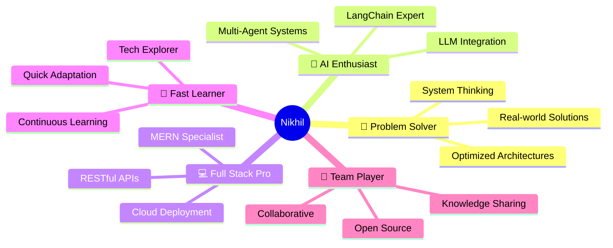

<div align="center">

<!-- Animated Banner -->


<!-- Dynamic Typing SVG -->


<p align="center">
  <em>🎯 Transforming complex problems into elegant solutions through code</em>
</p>

<p align="center">
  
  
  
  
  
</p>

<!-- Social Links with Icons -->
<p align="center">
  <a href="https://linkedin.com/in/KollipakulaNikhil"></a>
  <a href="mailto:kollipakulanikhil21@gmail.com"></a>
  <a href="https://github.com/KollipakulaNikhil"></a>
  <a href="tel:+919381675512"></a>
</p>

</div>

---

## 🚀 About Me

```javascript
const nikhil = {
    title: "Full Stack Developer & AI Engineer",
    location: "Ludhiana, Punjab, India 🇮🇳",
    education: "B.Tech in Computer Science Engineering",
    
    achievements: {
        hackathons: ["IIT Jodhpur 🏆", "IIT Ropar 🏆", "NIT Jalandhar 🏆", "LPU AI Fest 🏆"],
        totalWins: "4+",
        certifications: ["Azure AI-900", "Azure DP-900"]
    },
    
    currentlyWorkingOn: {
        project: "AI-Powered Placement Portal",
        features: ["Smart Resume Matching", "Fake Job Detection", "Analytics Dashboard"],
        status: "Building v2.0 with enhanced AI capabilities"
    },
    
    technicalExpertise: {
        frontend: ["React.js", "Tailwind CSS", "HTML5", "CSS3"],
        backend: ["Node.js", "Express.js", "REST APIs"],
        databases: ["MongoDB", "MySQL"],
        ai_ml: ["LangChain", "Ollama", "Multi-Agent Systems"],
        cloud: ["AWS EC2", "Azure AI", "Nginx"],
        tools: ["Git", "Socket.io", "Postman", "Playwright"]
    },
    
    currentFocus: [
        "Building Agentic AI Systems 🤖",
        "Microservices Architecture 🏗️",
        "Advanced System Design 📐",
        "Cloud-Native Development ☁️"
    ],
    
    passions: ["AI Innovation", "System Design", "Open Source", "Teaching & Mentoring"],
    
    lifePhilosophy: "Code with purpose, build with passion, solve real problems 🎯",
    
    funFact: "Won 4+ hackathons and built an AI that automates browser tasks! 🤯"
};

console.log("🚀 Building the future, one commit at a time!");
```

<details>
<summary><b>🎓 More About My Journey</b></summary>
<br>

- 🎯 **Mission**: Creating AI solutions that make a tangible difference in people's lives
- 🔬 **Research Interests**: Agentic AI, Multi-Agent Systems, Intelligent Automation, LLM Integration
- 🌱 **Continuous Learner**: Always exploring cutting-edge technologies and best practices
- 💡 **Innovation Mindset**: Don't just follow trends—create solutions that matter
- 🏆 **Achievement Oriented**: From hackathons to production deployments
- 🤝 **Collaborative Spirit**: Love working in teams and contributing to open source
- 📚 **Knowledge Sharing**: Passionate about documenting and teaching what I learn
- ⚡ **Fast Learner**: Quickly adapt to new technologies and frameworks

</details>

---

## 🏆 Featured Project Showcase

<div align="center">

### 🎯 AI-Powered Placement Portal
**Next-Generation Campus Recruitment Platform**


[](https://github.com/KollipakulaNikhil/Placement_Portal)
[](https://github.com/KollipakulaNikhil/Placement_Portal)

</div>

<table>
<tr>
<td width="50%">

### 💡 **Revolutionary Features**

🎯 **AI-Driven Matching Engine**
- Intelligent resume-job pairing using NLP
- Real-time compatibility scoring (%)
- Personalized job recommendations

🛡️ **Smart Security Layer**
- ML-powered fake job detection
- Company verification system
- Fraud pattern recognition

📊 **Advanced Analytics**
- Real-time placement insights
- Performance tracking dashboards
- Predictive analytics for trends

🔔 **Intelligent Automation**
- Auto-notifications for matches
- Scheduled interview reminders
- Application status tracking

👥 **Multi-Role Portal**
- Student dashboard with AI insights
- Company recruitment panel
- Admin analytics & controls

</td>
<td width="50%">

### 🛠️ **Technology Arsenal**

```yaml
🎨 Frontend Stack:
  Framework: React.js
  Styling: Tailwind CSS
  State: Context API
  Real-time: Socket.io

⚙️ Backend Stack:
  Runtime: Node.js
  Framework: Express.js
  Architecture: RESTful API
  Authentication: JWT

💾 Database Layer:
  Primary: MongoDB (NoSQL)
  Caching: Redis (planned)
  
🤖 AI/ML Pipeline:
  Frameworks: LangChain, Ollama
  Models: Custom trained models
  NLP: Resume parsing & analysis
  
☁️ Deployment:
  Cloud: AWS EC2
  Server: Nginx
  CI/CD: GitHub Actions (planned)
```

</td>
</tr>
</table>

<div align="center">

### 🌟 **Why This Project Stands Out**

> *"Not just another placement portal—it's an intelligent system that learns, adapts, and optimizes the entire recruitment lifecycle using cutting-edge AI."*

**🎓 Solving Real Problems** • **🚀 Scalable Architecture** • **🤖 AI-First Approach** • **📈 Data-Driven Insights**

</div>

---

## 🏆 Achievements & Recognition

<div align="center">

### 🥇 **Hackathon Champion - 4+ Wins**

<table>
<tr>
<td align="center" width="25%">
<br/>
<b>IIT Jodhpur</b><br/>
<sub>National Level Hackathon</sub><br/>
<sub>🎯 Innovation in Tech</sub>
</td>
<td align="center" width="25%">
<br/>
<b>IIT Ropar</b><br/>
<sub>Technical Excellence</sub><br/>
<sub>💡 Best Solution Award</sub>
</td>
<td align="center" width="25%">
<br/>
<b>NIT Jalandhar</b><br/>
<sub>Coding Competition</sub><br/>
<sub>⚡ Top Performance</sub>
</td>
<td align="center" width="25%">
<br/>
<b>LPU AI Fest</b><br/>
<sub>AI/ML Hackathon</sub><br/>
<sub>🤖 AI Innovation</sub>
</td>
</tr>
</table>


</div>

---

## 💼 Professional Highlights

<table>
<tr>
<td width="50%" valign="top">

### 🎯 **Internship Experience**

**📧 Email Creation Engine**
- Built TipTap-based rich text editor
- Integrated AI writing assistance
- Achieved WCAG 2.1 AA compliance
- Tech: React, Node.js, AI APIs

**🏢 Backend Development**
- Designed REST APIs with Express
- Implemented JWT authentication
- Optimized database queries
- Deployed on AWS EC2

</td>
<td width="50%" valign="top">

### 🏅 **Certifications**

| Certification | Provider | Year | Badge |
|--------------|----------|------|-------|
| **Azure AI Fundamentals** | Microsoft | 2024 |  |
| **Azure Data Fundamentals** | Microsoft | 2024 |  |

**📚 Currently Pursuing:**
- AWS Solutions Architect
- Advanced System Design

</td>
</tr>
</table>

---

## 💻 Tech Stack & Expertise

<div align="center">

### 🔤 **Programming Languages**


### 🎨 **Frontend Development**


### ⚙️ **Backend Development**


### 🗄️ **Database & Storage**


### 🤖 **AI/ML & Automation**


### ☁️ **Cloud & DevOps**


### 🛠️ **Development Tools**


</div>

---

## 📂 Project Portfolio

<div align="center">

| 🚀 Project | 📝 Description | 🛠️ Tech Stack | 📊 Status | 🔗 Link |
|-----------|---------------|--------------|----------|---------|
| **🎯 AI Placement Portal** | Smart placement system with AI matching & fake job detection | MERN + LangChain + Ollama | 🚧 Active | [View](https://github.com/KollipakulaNikhil/Placement_Portal) |
| **🛡️ ExamGuard** | Real-time examination integrity monitoring with AI proctoring | MERN + Socket.io + Chrome Ext | 🚧 In Progress | - |
| **📧 Email Creation Engine** | Rich text email editor with AI writing assistance & accessibility | React + TipTap + AI APIs | ✅ Completed | - |
| **🤖 AI Browser Navigator** | Automated web browsing powered by local LLM | LangChain + Ollama + Playwright | ✅ Completed | - |
| **🏥 Medical Consultation Platform** | Online telemedicine with appointment scheduling | MERN Stack | ✅ Completed | - |
| **🅿️ Smart Parking System** | IoT-based intelligent parking management | Full Stack + IoT Sensors | ✅ Completed | - |
| **🎬 Movie Ticket Booking** | Cinema booking system with seat selection | MySQL + Backend | ✅ Completed | - |
| **📊 Academic Performance Analytics** | Student performance tracking & analysis | MERN + Charts.js | ✅ Completed | - |

</div>

---

## 📈 GitHub Statistics

<div align="center">


</div>

<div align="center">
  
[](https://git.io/streak-stats)

</div>

<div align="center">


</div>

<div align="center">

### 🏆 **GitHub Trophies**

[](https://github.com/ryo-ma/github-profile-trophy)

</div>

---

## 🎯 Current Focus & Learning Path

<table>
<tr>
<td width="33%" align="center">

### 🚀 **Building**

🎯 **ExamGuard v2.0**
- Chrome Extension
- AI Proctoring
- Real-time Monitoring

🤖 **AI Placement Portal**
- Enhanced ML Models
- Advanced Analytics
- Mobile App (planned)

</td>
<td width="33%" align="center">

### 📚 **Learning**

🏗️ **System Design**
- Microservices
- Scalability Patterns
- Distributed Systems

☁️ **Cloud Architecture**
- AWS Advanced
- Kubernetes
- Serverless

</td>
<td width="33%" align="center">

### 🔬 **Exploring**

🤖 **AI/ML**
- Multi-Agent Systems
- RAG Applications
- LLM Fine-tuning

⚡ **Advanced Topics**
- WebAssembly
- Event-Driven Arch
- GraphQL

</td>
</tr>
</table>

---

## 🌟 What Sets Me Apart

<div align="center">



</div>

---

## 💡 My Development Philosophy

<div align="center">

| Principle | What It Means |
|-----------|---------------|
| 🎯 **Purpose-Driven Code** | Every line of code should solve a real problem |
| 🏗️ **Architecture First** | Design scalable systems from day one |
| 🧪 **Test & Iterate** | Build, test, learn, improve—repeat |
| 📚 **Documentation Matters** | Code is read more than written |
| 🤝 **Collaborative Growth** | Learn from others, share knowledge freely |
| ⚡ **Performance Obsessed** | Fast, efficient, optimized—always |
| 🔒 **Security by Design** | Build secure systems from the ground up |
| 🌱 **Continuous Learning** | Technology evolves, so should we |

</div>

---

## 🎓 Education & Academic Excellence

<div align="center">

**🎓 Bachelor of Technology in Computer Science Engineering**

📍 **Focus Areas**: 
- Data Structures & Algorithms
- Database Management Systems
- Computer Networks
- Operating Systems
- Software Engineering
- Artificial Intelligence & Machine Learning

📊 **Key Projects**:
- MySQL Database Systems (Movie Booking, Academic Analytics)
- Network Configuration (IPv4/IPv6, Static/Dynamic Routing)
- Full Stack Applications (MERN Stack)

</div>

---

## 🤝 Let's Connect & Collaborate!

<div align="center">

<table>
<tr>
<td align="center" width="33%">

### 💼 **Professional**

[](https://linkedin.com/in/KollipakulaNikhil)

Let's network and grow together!

</td>
<td align="center" width="33%">

### 📧 **Contact**

[](mailto:kollipakulanikhil21@gmail.com)

Open for opportunities & collaborations

</td>
<td align="center" width="33%">

### 📱 **Quick Chat**

[](tel:+919381675512)

+91 9381675512

</td>
</tr>
</table>

</div>

---

## 💭 Inspirational Quote

<div align="center">


</div>

---

## 🎯 Fun Facts About Me

<details>
<summary><b>Click to reveal! 🎉</b></summary>
<br>

- 🤖 Built an AI that browses the web autonomously using local LLMs
- ⚡ Can debug code faster after a cup of coffee ☕
- 🎮 Love solving algorithmic puzzles and competitive programming
- 📚 Read tech blogs and research papers for fun
- 🌟 Believe in "code that speaks for itself"
- 🚀 Dream of contributing to major open-source AI projects
- 💡 Always have 3-4 side project ideas brewing in my mind
- 🏆 Participated in multiple hackathons and coding competitions

</details>

---

<div align="center">

### 🐍 **Contribution Activity**


</div>

---

<div align="center">

### ⭐ **Show Some Love!**

**If you find my work interesting or helpful, consider:**

[](https://github.com/KollipakulaNikhil?tab=repositories)
[](https://github.com/KollipakulaNikhil)
[](https://github.com/KollipakulaNikhil?tab=repositories)

---

### 📊 **Profile Views Counter**


---

<sub>**Made with ❤️ and lots of ☕ by Nikhil Kolliapakula**</sub>

<sub>*"Building the future, one commit at a time"* 🚀</sub>

---

**💡 Open to**: Internships • Full-time Roles • Freelance Projects • Open Source Collaboration

**🎯 Specializing in**: AI Integration • Full Stack Development • System Architecture • Cloud Solutions

</div>

<!-- Animated Footer -->

